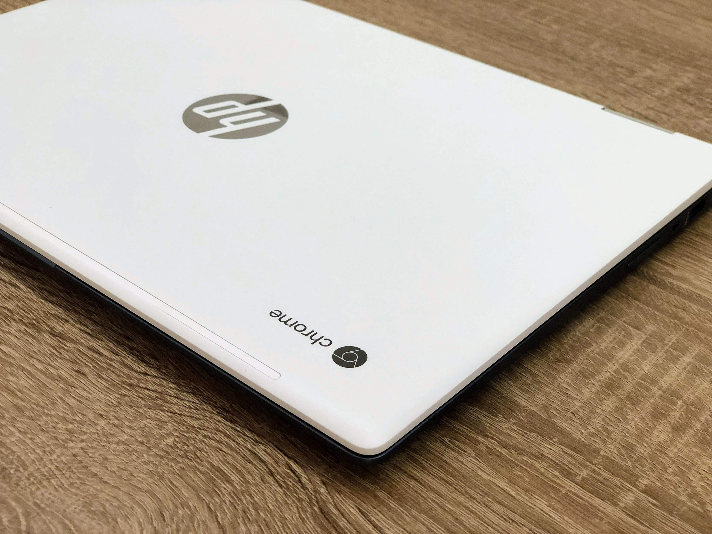
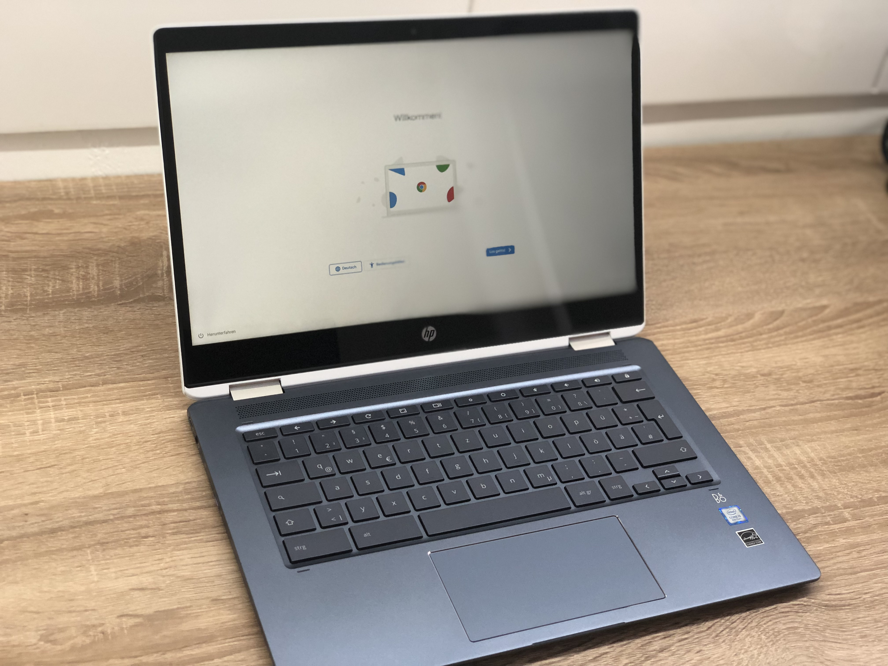
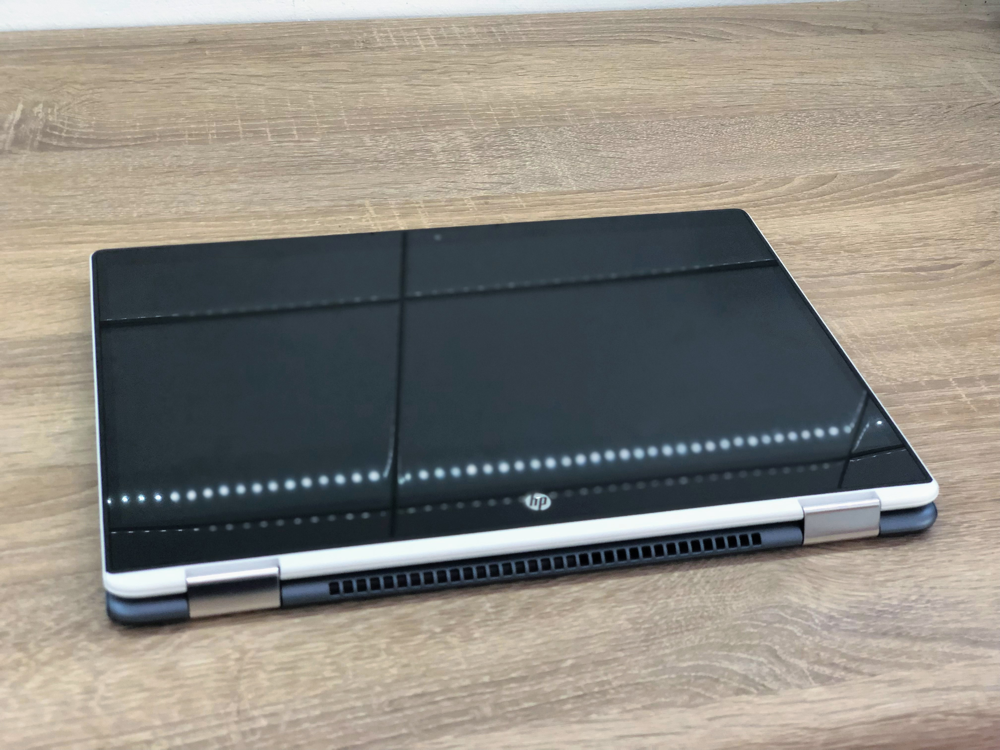
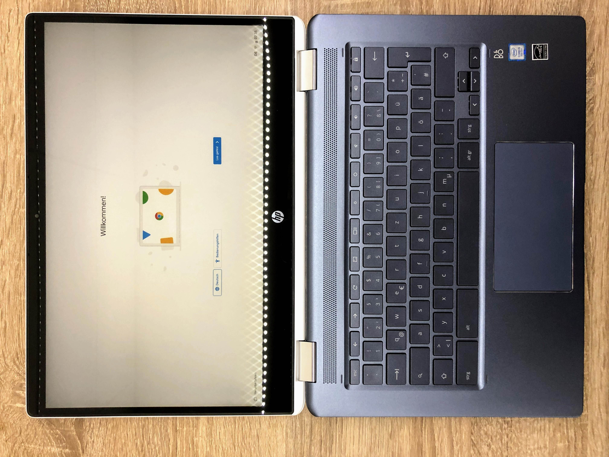
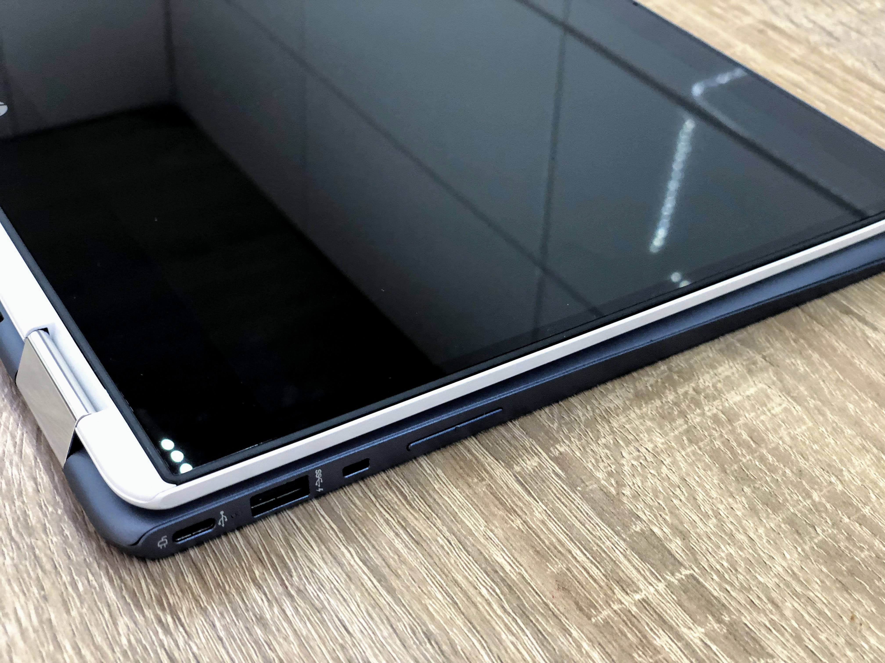

С недавних пор я стал владельцем ноутбука-планшета HP Chromebook x360 14 работающего на операционной системе от Google - Chrome OS. Скажу сразу, первые впечатления от устройства и операционной системы позитивные, поэтому я доволен приобретением. Далее пару слов о выборе Chrome OS и о будущем этого канала.

_Хромбук-транформер HP Chromebook x360 14_

## Выбор устройства с Chrome OS

Изначально я приглядывался к планшету в большей степени для "диванного" использования, т.е. для потребления контента - чтение, просмотр YouTube, браузинг. Так же планшет рассматривался мною и для блогинга. Это значит что хотелось устройства с большим touch-дисплеем и с физической клавиатурой для быстрого и удобного набора текста.

Большая версия iPad для диванного использования отпала из-за цены, поэтому остается альтернатива в лице планшеты на Android. В новых планшетах от Samsung мне понравилась функция режиме DeX, позволяющая использовать приложения системы Android в многооконном режиме. Подключив все это к большому монитор, то в теорий можно получить полноценную рабочую станцию (плюс еще доступна бетка с Linux on DeX).

Но в какой-то момент, в сравнениях и обзорах на просторах интернета, я наткнулся на забытую мною Chrome OS...

В итоге, стоит признать, что в выборе устройства в большей степени победило любопытство и интерес к новой операционной системе. Хотя в конце-концов я понимал что в случае с Chrome OS речь идет о "расширенной" версий браузера с парочкой приложений для доступа к файловой системой. Но, возможность запускать Android-приложения, а теперь и поддержка Linux, в свежей версий ОС, делают хромбуки сразу намного интереснее. Добавим сюда еще и форм-фактор самого устройства - это touch-экран с полноценной подсвеченной клавиатурой, а так же возможность откидывания экрана на 360 градусов. В итоге мы получаем ноутбук-планшет с Android, Chrome OS (мультиоконность, а-ля Samsung DeX) и Linux - неплохо, не правда ли? Вот и я не смог устоять.

_Первый запуск Chrome OS_

## Что будет дальше и в чем заключается идея этого сайта

Так как на просторах рунета пока что не так много материалов на тему Chromebook'ов и Chrome OS, то я предлагаю вместе знакомиться с возможностями этой системы. Рассмотреть базовый функционал, знакомиться с полезными сторонними приложениями. А так же в целом рассмотреть возможные сценарий использования таких устройств с системой Chrome OS. И конечно же, будем наблюдать за развитием системы, ждать новых фич и пробовать их в экспериментальном режиме.

