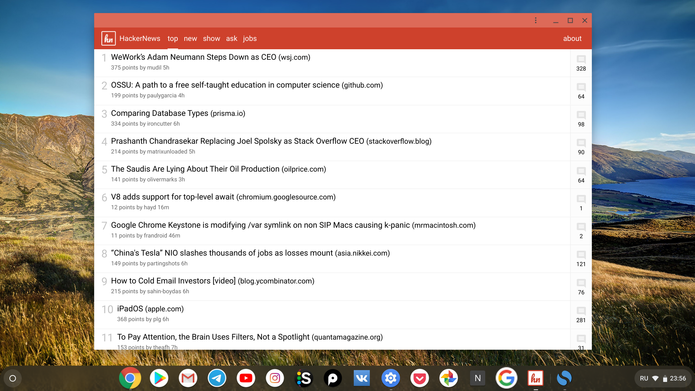
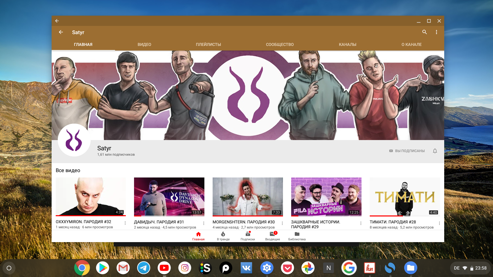
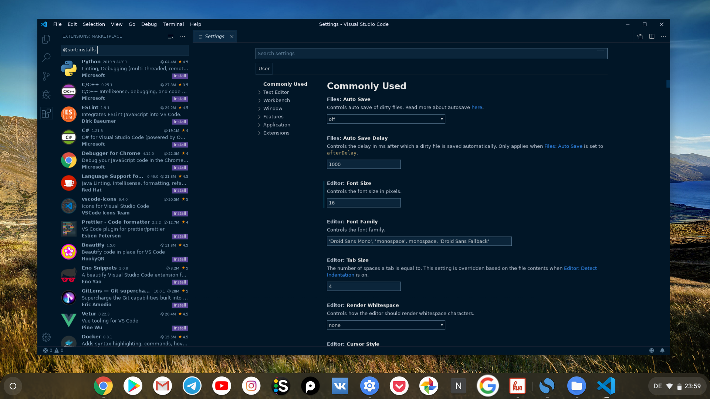

В этой небольшой заметке я хотел бы рассмотреть все возможные типы приложений работающих на хромбуках с Chrome OS.

## 1. PWA - Progressive Web Apps
Пожалуй, это та категория приложений, которую на данном этапе развития можно смело назвать "нативными" для Chrome OS.

Прогрессивные веб-приложения являются гибридом обычного сайта и мобильного приложения. Как и сайты, приложение такого типа созданы с помощью веб-технологий JavaScript, HTML и CSS.

На сегодняшний день Google активно продвигает такие приложения, так как многое из того что можно установить из Chrome Store по сути и является PWA "обвернутым" в Chrome-приложение или расширение.

В Chrome OS 76 можно легко определить поддержку PWA на сайте, а так же установить его. Для этого достаточно перейти на страничку с прогрессивным приложением и обратить внимание на правую часть адресной строки. Здесь можно увидеть иконку для быстрой установки (например, лента новостей HackerNews). После установки ярлык приложения появиться в лаунчере, а при его запуске оно откроется уже не в браузере, а в отдельном окне как полноценное приложение.

*Страница HackerNews с утановкой PWA*

Возможно все это звучит немного запутанно, но возможен еще один сценарий. Благодаря развитию веб-технологий, PWA-приложения могут так же распространяться в виде Android-приложений. То есть разработчик может взять свой сайт/веб-приложение, "запаковать" его в apk-файл и опубликовать в Play Store. В этом случае PWA и Android приложение будут выглядеть абсолютно идентично.

")
*Прогрессивное веб-приложение HackerNews (PWA)*

## 2. Android-приложения
Большинство приложений из Play Store легко установятся на ваш хромбук. Будут ли они работать корректно - это уже другой вопрос. Например, текущая версия приложения ВКонтакте для Android у меня успешно установилась, но при запуске отображается только пустой экран.

Впрочем, это пока что единственный случай с нерабочим приложением и я надеюсь, что скоро это исправят.

Кстати, так же есть возможность установки скачанных приложений из apk-файлов, но для этого нужно активировать режим разработчика. С этим я пока что не разбирался, но мы обязательно рассмотрим эту возможность в будущем.

*Android-приложение YouTube*

## 3. Программы под Linux
Linux режим пока еще не был протестирован мною полноценно. Планирую попробовать ряд программ для разных сценариев и посветить этому отдельную заметку. Но сама возможность запуска Linux-программ открывает огромное количество возможностей для использования хромбука.

Например:

- Visual Studio Code (или Atom) + git для разработки
- GitKraken в качестве GUI для работы с git-репозиториями
- Android Studio для разработки под андроид на производительных хромбках
- GIMP для обработки фото
- LibreOffice в качестве альтернативного офиса если вам не подходит облачный офис от Google
- Приложения на основе Electron, приложения из Snap Store, Flatpak ...

*Редактор VS Code установленный с помощью *.deb-файла*
