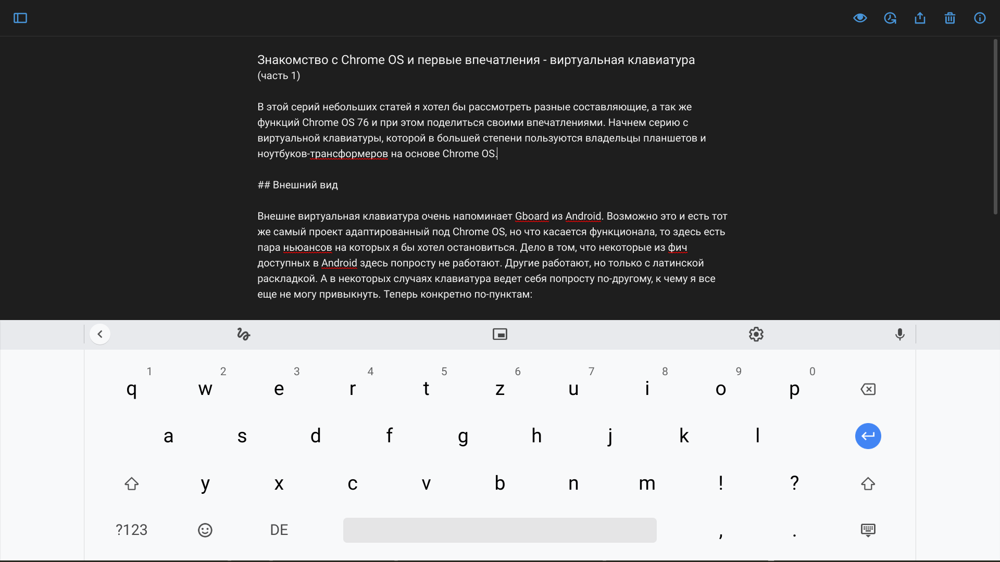
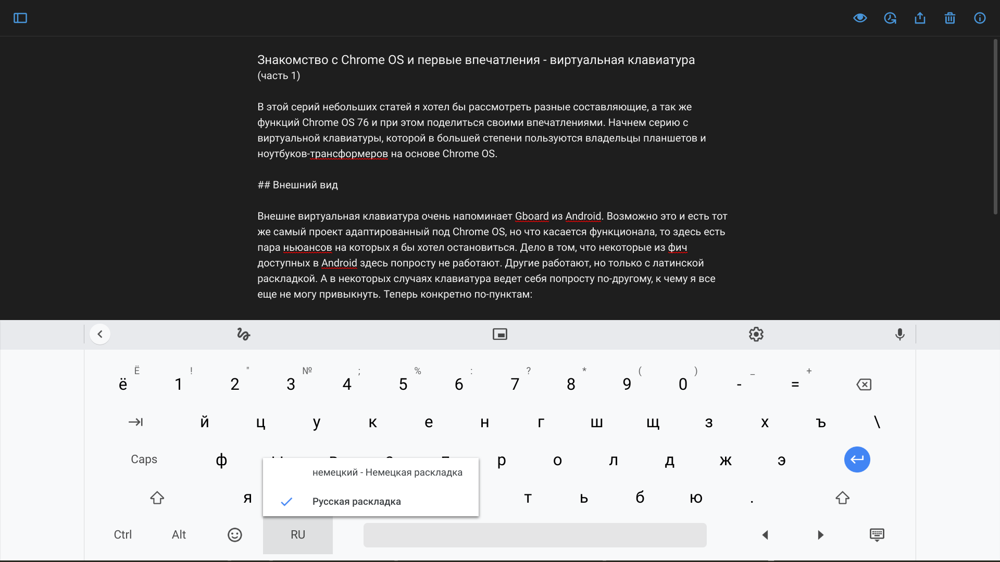
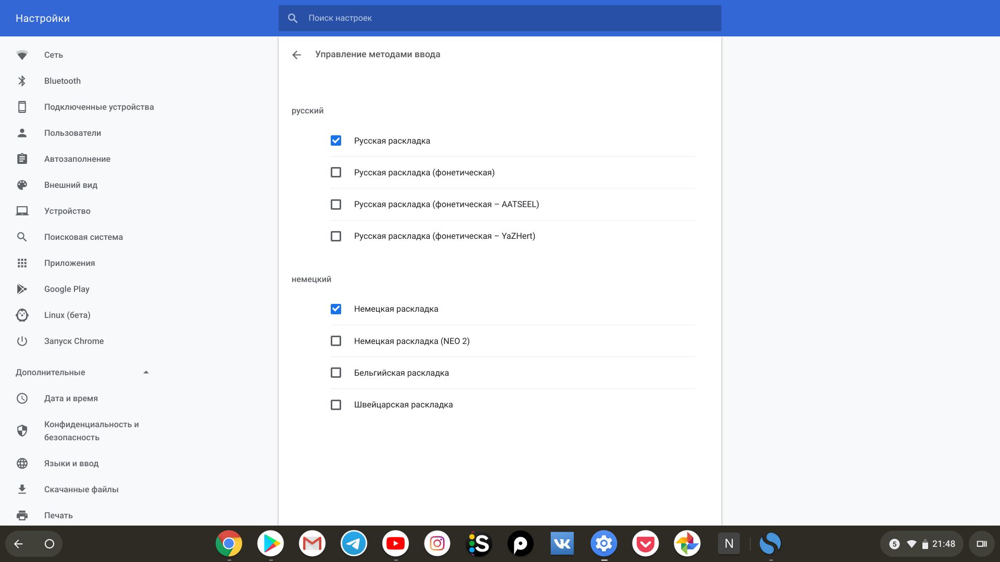

В этой серий небольших статей я хотел бы рассмотреть разные составляющие, а так же функций Chrome OS 76 и при этом поделиться своими впечатлениями. Начнем с обзора виртуальной клавиатуры, которой пользуются владельцы планшетов и ноутбуков-трансформеров на основе Chrome OS.

*Виртуальная клавиатура с немецкой раскладкой (редактор Simple Note)*

## Внешний вид
Внешне виртуальная клавиатура очень напоминает [Gboard](https://play.google.com/store/apps/details?id=com.google.android.inputmethod.latin&hl=ru) из Android. Возможно это и есть тот же самый проект адаптированный под Chrome OS, но что касается функционала, то здесь есть пара нюансов на которых я бы хотел остановиться. Дело в том, что некоторые из фич доступных в Android здесь попросту не работают. Другие работают, но только с латинской раскладкой. А в некоторых случаях клавиатура ведет себя попросту по-другому, к чему я все еще не могу привыкнуть.

Теперь конкретно по-пунктам:

### 1. Авто-исправление и предложение альтернативных вариантов слов
Функция авто-исправления, а так же строка над клавиатурой с предложениями вариантов слов для быстрого набора - все это отлично работает с английской и немецкой раскладками клавиатуры, но с русским языком обе функций недоступны.

### 2. Непрерывный ввод
Опять-таки функция прекрасно работает с английским языком, проводим пальцем по буквам наблюдаем за синим шлейфом и вуаля. С русской раскладкой - беда.

### 3. Передвижение курсора
В Gboard на андроид и iOS курсор можно передвигать с помощью кнопки пробела. Здесь эта функция недоступна и я не нашел соответствующих настроек.

### 4. Переключение языка
При переключений языка появляется дополнительное выпадающее меню из которого необходимо выбрать нужный вам язык. То есть сам процесс переключения языка занимает два клика/тапа, что само по себе не очень удобно для быстрой печати. Возможно я слишком придираюсь и это дело привычки, но в большинстве клавиатур на планшетах и мобильных ОС смена языка происходит в один клик, как обычное переключение состояния.

*Переключение раскладки клавиатуры*

### 5. "Залипание" Shift'а на кириллической раскладке
В некоторых случаях клавиша Shift для написания заглавных букв "залипает" при нажатий и ведет себя как Caps Lock. После поставленной точки и пробела текст не начинается с главной буквы.

## Главная претензия
Понимаю, что многие из перечисленных вещей являются мелочами. Тем не менее все они являются недочетами, и вносят определенные неудобства при вводе текста.

Подведя итог можно сказать, что главная претензия с моей стороны сводятся к тому, что многие вещи попросту не работают или ведут себя не так как следует, только с русской раскладкой. Возможно это связано с тем, что Chromebook'и вместе с операционной системой на данный момент не так популярны в русскоязычных странах и странах где используют кириллическую клавиатуру.

Несмотря на это, конечно хотелось бы чтобы в Google уделили внимание и добавили весь упомянутый функционал доступный для английской или немецкой клавиатуры и для кириллицы. В конце-концов все это уже давно прекрасно работает на Android.

*Настройки виртуальной клавиатуры*

## Другие пожелания или чего не хватает (Chrome OS 76)
Помимо всех упомянутых мною недочётов, мне в голову пришли еще две функций доступных в Gboard на Android и iOS:

### 1. Возможность установки и выбора альтернативной клавиатуры:

Насколько я понял основную клавиатуру заменить нельзя, по-крайней мере я не нашел подходящей опций в настройках. Тем не менее я попробовал установить [SwiftKey Keyboard](https://play.google.com/store/apps/details?id=com.touchtype.swiftkey&hl=ru) из Play Store, но активировать её у меня не вышло.

### 2. Темы для клавиатуры

Было бы отлично иметь возможность сменить стандартный белый цвет фона клавиатуры на какой-нибудь другой, например на её темную версию. Опять же если взглянуть на андроид версию клавиатуры, то там доступно немалое количество различных тем.

*PS: В виде дисклеймера хочу упомянуть о своем опыте использования Chrome OS составляющего около одной недели. Поэтому если я что-то упустил или в чем-то не разобрался, то буду рад узнать об этом в комментариях :-)*