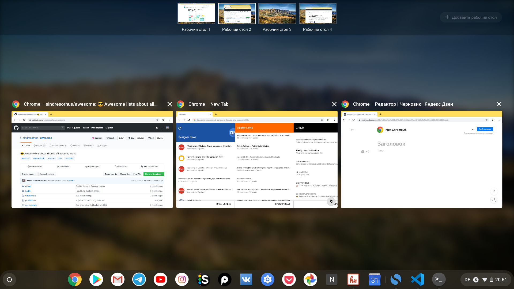
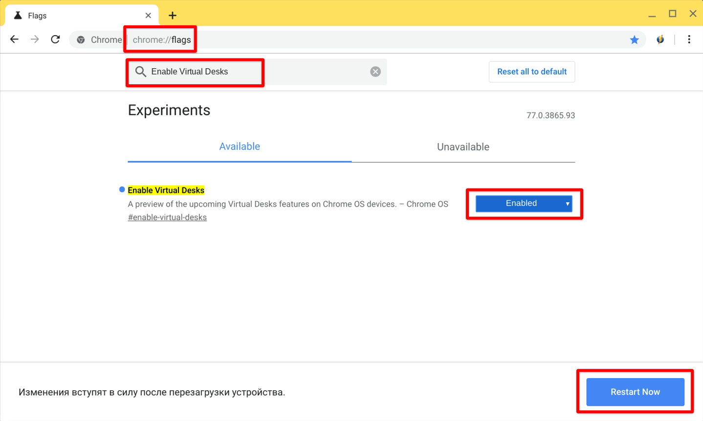

Возможность иметь и переключаться между несколькими рабочими столами доступна во всех известных операционных системах - Linux, MacOs и Windows. Аналогичная возможность с недавних пор стала доступной и в Chrome OS. Правда, по умолчанию функция Virtual Desks отключена в 77 версий операционной системы. Поэтому сегодня я предлагаю активировать и попробовать её.

*Виртуальные рабочие столы в Chrome OS*

## Как включить виртуальные рабочие столы
Для того чтобы активировать рабочие столы, открываем браузер и переходим на страничку [chrome://flags](chrome://flags). В поиске находим функцию под названием "Enable Virtual Desks", включаем её ("Enable") и нажимаем на кнопку перезагрузки для активаций.

*Активация функций виртуальных столов на странице chrome://flags*

Чтобы создать новый рабочий стол необходимо перейти к виду с обзором всех приложений. Сделать это можно нажав на кнопку "[]]]" ("Overview") или смахнув тремя пальцами вниз на тачпаде хромбука. В верхней части экране будут видны все созданные рабочие столы, а в правом верхнем углу доступна кнопка для создания нового стола. Там же можно переключиться на другой рабочий стол, кликнув по нему.

Быстрое переключение между рабочими столами возможно и с помощью тачпад-жестов. В Chrome OS используется такой же жест, как и в macOs. Поэтому если Вы до этого пользовались макбуком, то Вам не придется привыкать к чему-то новому. Просто смахиваем четырьмя пальцами влево или вправо для перехода на нужный рабочий стол.