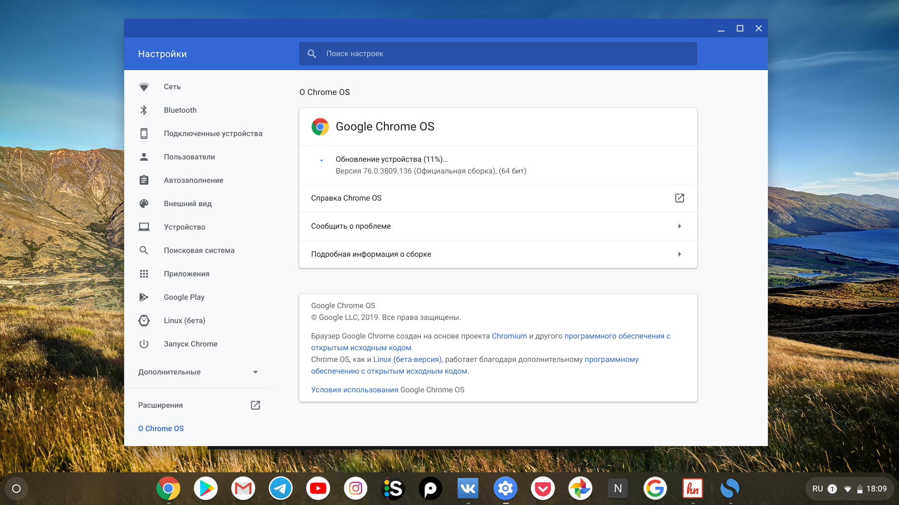
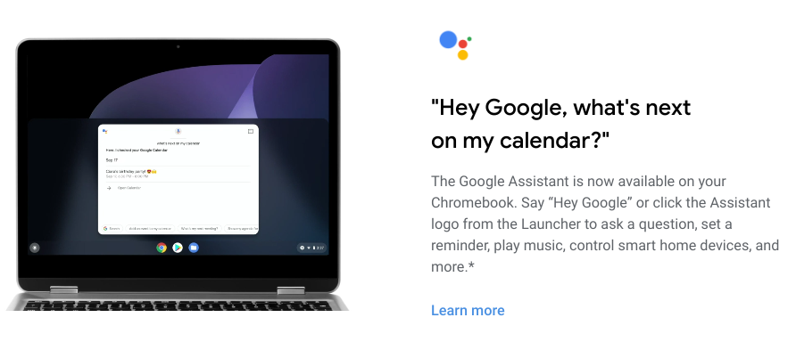
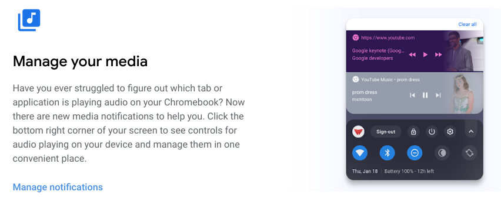
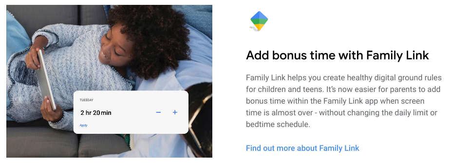
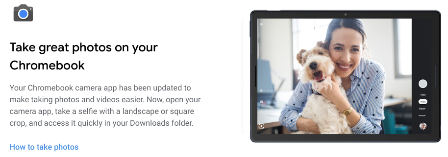
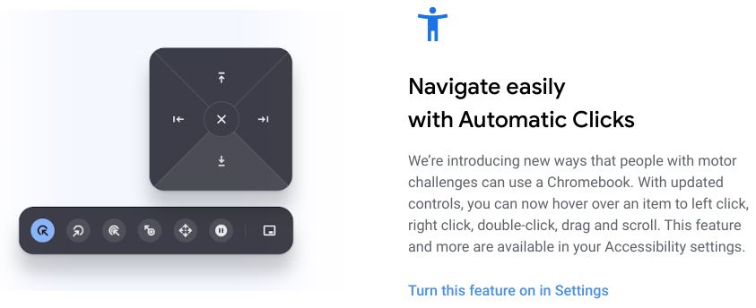

На днях для [большинства хромбуков](https://cros-updates-serving.appspot.com/) стала доступной новая версия операционной системы Chrome OS 77. Предлагаю обновиться, посмотреть на изменения, заглянуть в Changelog и ответить на главный вопрос - что нового в версий 77.

_Настройки - обновление Chrome OS до версий 77_

Сразу после обновления и перезагрузки нас встречает страничка ["What's new"](https://www.google.com/chromebook/whatsnew/embedded/?version=77&tags=nami-signed-mp-v5keys) с описанием главных изменений. Несмотря на то, что русский язык в системе указан в качестве основного, все изменения описаны на английском. То есть пока что Google не переводит такие вещи для русскоязычной аудиторий, что само по себе немного обидно.

Ну да ладно, Google делает акцент на следующих 5 фичах:

### 1. Поддержка Google Assistent

Многие знакомы с приложением ассистента на Android, примерно тоже стало доступным и в Chrome OS. Но, к сожалению, ассистент [не доступен](https://9to5google.com/2019/09/12/google-assistant-chromebooks-15-countries/) для русского языка, поэтому потестировать его на русском у нас не получиться.

В сети пишут, что достаточно переключить системный язык на английский, чтобы активировать ассистента и попробовать его возможности.

_Google ассистент доступен в 15 странах_

### 2. Улучшенный контроль воспроизведения мультимедиа-файлов

Теперь если запустить какой-либо мультимедиа-контент во вкладке браузера или каком-либо отдельном приложений, то появиться оповещение из которого можно управлять воспроизведением. Странно, но как мне кажется все это было и в прошлой версий...

_Управление воспроизведением медиа-файлов в Chrome OS 77_

### 3. Family Link

Если совсем коротко, то здесь речь идет о новых возможностях в функций родительского контроля.

_Управление лимитом времени в функционале родительского контроля Chrome OS 77_

### 4. Улучшенное приложение камеры

Добавили кнопочку для быстрого доступа к галерее из самого приложения "Фото". В целом был переработан весь дизайн приложения, а так же добавлены новые режимы съемки, например, фото квадратной формы.

_Обновленное приложение фото камеры_

### 5. Automatic Clicks

Новые возможности для работы с Chrome OS для людей с ограниченными возможностями. Очень приятно что Google уделяет внимание такому функционалу и добавляет подходящие элементы управления системой.

_Новые возможности управления системой Chrome OS для людей с ограниченными возможностями_
