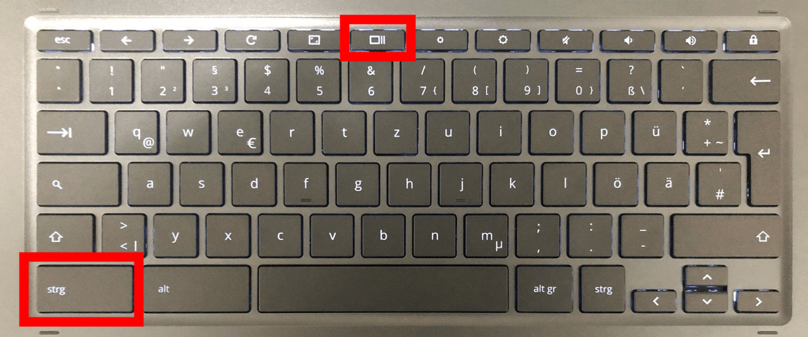
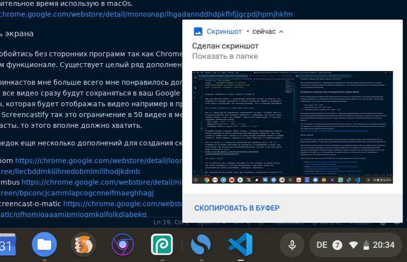
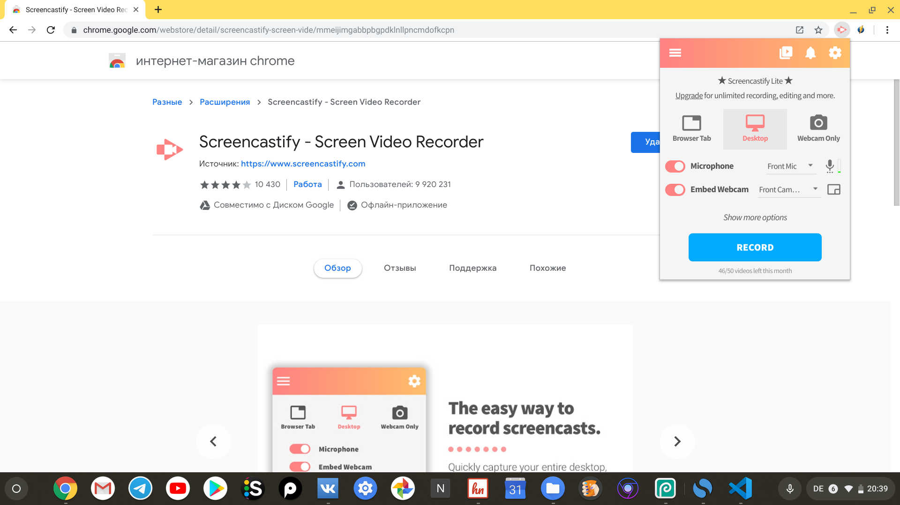

При повседневной работе с современными девайсами сегодня не обойтись без возможности создания скриншотов и записи скринкастов. Давайте разберемся с этой темой и рассмотрим, как нативные функций, так и сторонние приложения.

## Создание скриншотов стандартными средствами

Как и в любой другой современной операционной системе в ChromeOs имеется встроенная функция для создания скриншотов с поддержкой трех разных видов снимков экрана. Если у вас хромбук с физической клавиатурой, то доступны следующие комбинаций клавиш:

- Весь экран - Ctrl + "[ ]||"
- Выбранное окно (Ctrl + Alt + "[ ]||")
- Свободная область экрана (Ctrl + Shift + "[ ]||")

_Физическая клавиатура HP Chromebook x360 14_

В режиме планшета скриншот можно создать с помощью одновременного нажатия кнопки включения и кнопки увеличения или уменьшения громкости. При этом создается снимок всего экрана и это единственный возможный вариант в режиме планшета. Новый скриншот сохраняется в папку Downloads ("Скачанные файлы").

Чего не хватает в стандартном приложений для просмотра фото, так это возможности создания аннотаций на скриншотах и изображениях в целом. Для этих целей я бы посоветовал дополнение [Monosnap](https://chrome.google.com/webstore/detail/monosnap/lhgadannddhdpkfhfjjgcpdjhpmjhkfm), которое я уже длительное время использую в macOs.

_Оповещение о созданий скриншота_

## Запись экрана

В случае с записью видео не обойтись без сторонних приложений, так как ChromeOs не предоставляет нам такой возможности в базовом функционале. Существует целый ряд дополнений для хрома позволяющие записывать скринкасты.

Мне больше всего мне понравилось дополнение [Screencastify](https://chrome.google.com/webstore/detail/screencastify-screen-vide/mmeijimgabbpbgpdklnllpncmdofkcpn). Во-первых можно настроить так что все видео сразу будут сохраняться в ваш Google Drive аккаунт. Во-вторых есть поддержка фронтальной камеры, которая будет отображать видео, например, в правом нижнем углу экрана. Небольшой минус бесплатной версий Screencastify, так это ограничение в 50 видео в месяц. Но если вы не так часто записываете скринкасты, то этого вполне должно хватить.

_Дополнение Screencastify_

Напоследок еще несколько дополнений для создания скриншотов и записи экрана:

- [Loom](https://chrome.google.com/webstore/detail/loom-video-recorder-scree/liecbddmkiiihnedobmlmillhodjkdmb)
- [Nimbus](https://chrome.google.com/webstore/detail/nimbus-screenshot-screen/bpconcjcammlapcogcnnelfmaeghhagj)
- [Screencast-o-matic](https://chrome.google.com/webstore/detail/screencast-o-matic/ofhomjgaaamjpmjogmkglfojkdlabekg)
- [Scrn.li](https://chrome.google.com/webstore/detail/scrnli-screenshot-tool-an/ialiedlpfknneamnbemcgmaboleiccdd)
