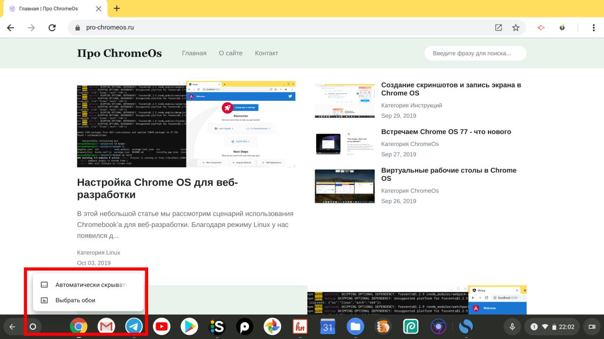
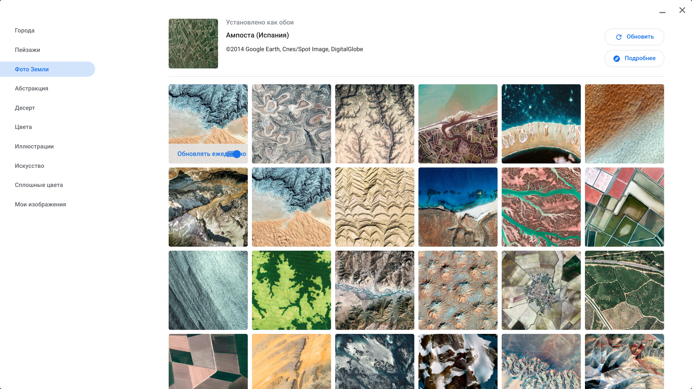

---
layout: post
title: Как сменить обои в Chrome OS
categories:
- Инструкции
image: "../uploads/change-wallpapers/wallpapers-app.png"
tags:
- chromeos
- tutorials

--- 
Сегодня коснемся простого, но популярного среди пользователей вопроса, смены обоев для рабочего стола, как из режима планшета так и ноутбука.

В Chrome OS 77 достаточно нажать по иконке лаунчера и не отпускать до тех пор, пока не появиться выпадающее меню в котором нас интересует опция "Выбрать обои".

*Меню с опцией для выбора обоев*

В открывшемся приложений "Wallpaper Picker" доступны разные категорий с заготовленными обоями, а так же доступен вариант выбора своей картинки/фотографий в качестве фона. Кроме того для тех кто любит регулярно менять заставки, здесь же доступна функция автоматической смены обоев в повседневном режиме.

**

В режиме ноутбука также можно открыть приложение с обоями с помощью клика по рабочему столу и выбора той же самой опций.