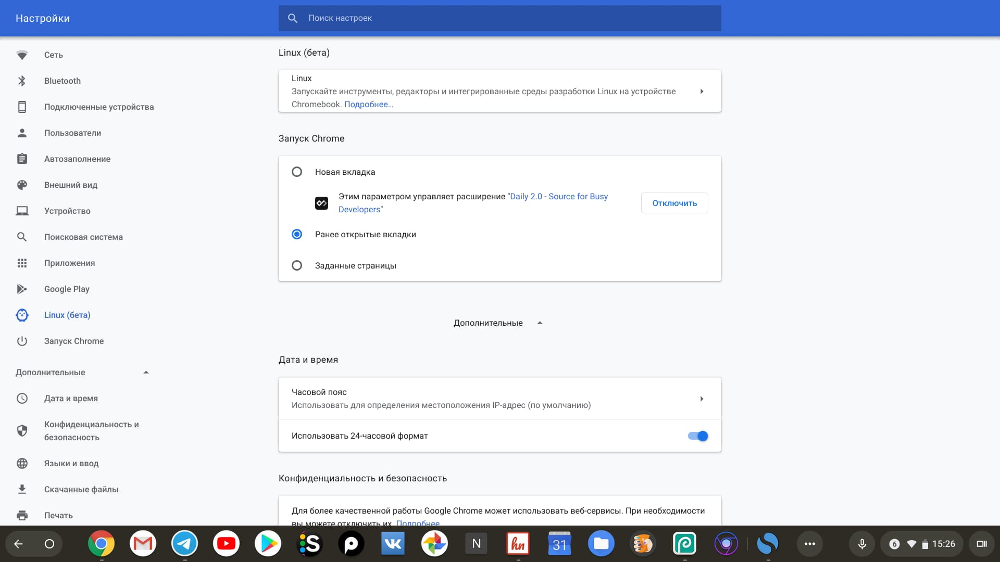
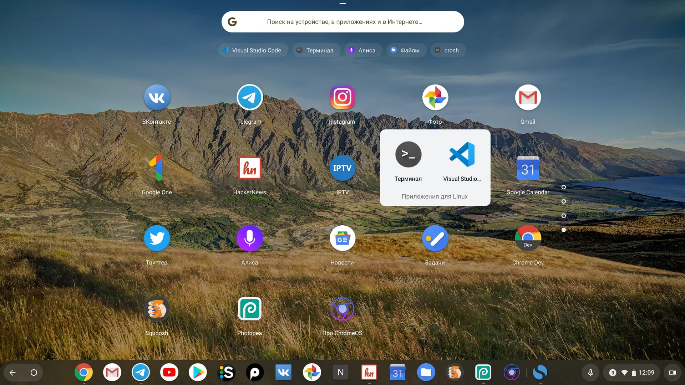
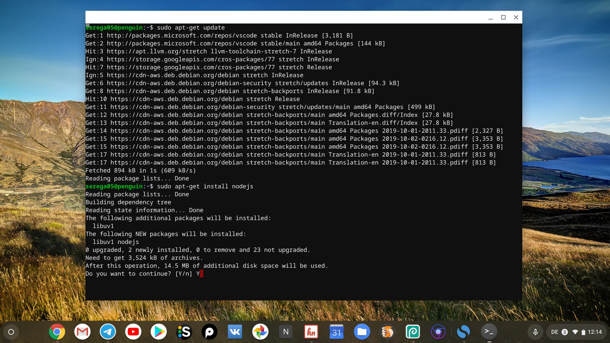
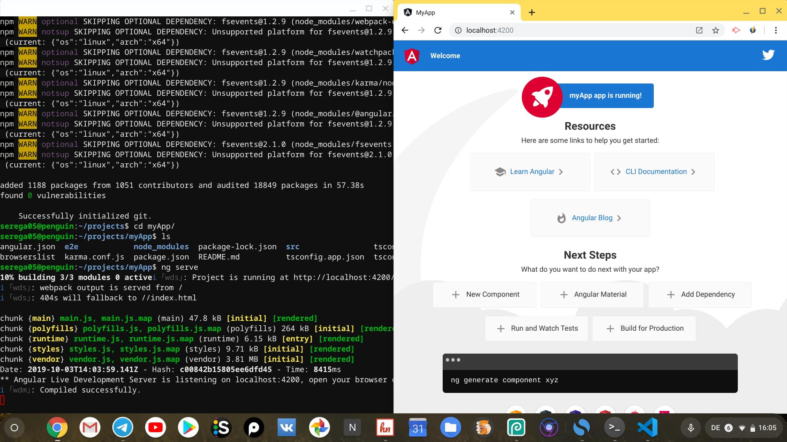
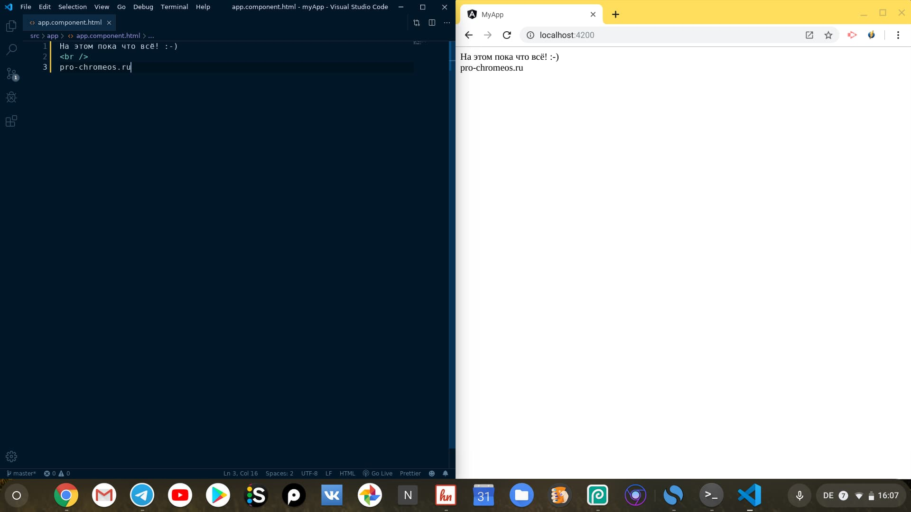

В этой небольшой статье мы рассмотрим сценарий использования Chromebook'а для веб-разработки. Благодаря режиму Linux у нас появился доступ не только к облачным редакторам и IDE, но и к полноценным редакторам кода доступных для Linux.

## 1. Активация Linux-режима

Первым делом необходимо активировать режим Linux. Для этого переходим в настройки, находим меню "Linux (Beta)" в боковом меню и активируем его. Процесс установки займет буквально пару минут и после этого у нас под капотом будет Debian 9.

*Активация Linux-режима в настройках Chrome OS*

## 2. Установка VS Code

Самым популярным редактором для веб-разработки на сегодняшний день является Visual Studio Code. Для его установки необходимо скачать *.deb файл с [сайта VSCode](https://code.visualstudio.com/) и дважды кликнуть по нему.

После установки редактора его можно будет найти в списке всех программ - в папке "Приложения Linux" вместе с приложением терминала.

*Папка с Linux-приложениями в лаунчере*

## 3. Установка Git, NodeJs с NPM 

После активаций Linux-режима нам доступен apt (advanced packaging tool) - это пакетный менеджер для установки/удаления программ через командную строку. С его помощью мы и будем устанавливать все необходимые инструменты для разработки. 

### 3.1 Установка Git

Git у меня установился автоматически вместе с активацией Linux-режима. Проверить, установлен ли git, можно с помощью команды `git --version`, выполнив ее в терминале.  Если нет то устанавливаем:

    $ sudo apt-get install git -y

### 3.2 NodeJs и NPM

Получаем обновления:

    $ sudo apt-get update

Устанавливаем необходимые утилиты - curl и gnupg:

    $ sudo apt-get install curl gnupg -y

И наконец NodeJs и менеджер пакетов npm:

    $ curl -sl https://deb.nodesource.com/setup_10.x | sudo -E bash -
    $ sudo apt-get install -y nodejs

После установки проверяем:

    $ node --version
    $ npm --version

*Установка NodeJs*

## 4\. Создадим и запустим базовое Angular-приложение 

Для примера соберем небольшое приложение на ангуляре. Первым делом установим инструмент командной строки Angular:

    $ sudo npm install @angular/cli -g

После этого лучше всего создать какую-нибудь папку, где будут храниться все проекты. Я назову её `projects`, перейду в нее и с помощью установленного Angular CLI сгенерирую новое приложение:

    $ cd projects
    $ ng new newApp

Теперь перейдем в папку с сгенерированным приложением и наконец запустим его:

    $ cd newApp
    $ ng serve

Открываем браузер, кликая по ссылке из командной строки [http://localhost:4200](http://localhost:4200) и убеждаемся что наше приложение работает. Тем самым мы подготовили базовое окружение для веб-разработки.

*Окно терминала с работающим Angular-приложением и окно браузера*

## Что неудобно 

1. Переключение раскладки клавиатуры горячими клавишами, на данный момент, не работает в Linux-приложениях. Чтобы сделать это нужно открыть другое окно и уже там переключить языковую раскладку.
2. Размытый шрифт и масштабирование в VS Code.

*Окно VSCode с шаблоном Angular-компонента и окно браузера*