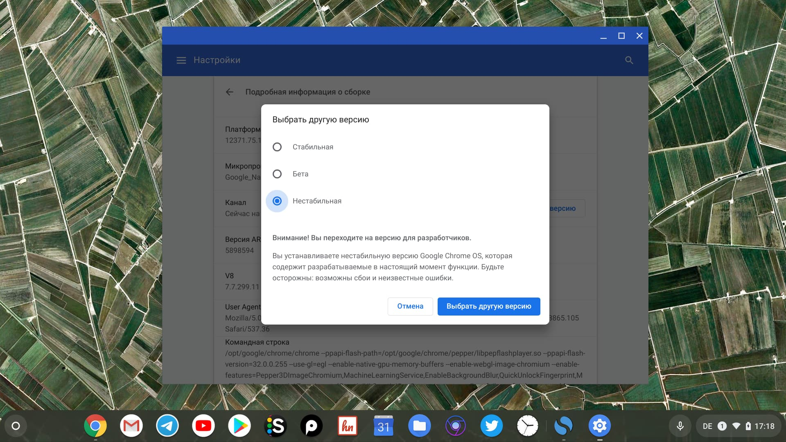
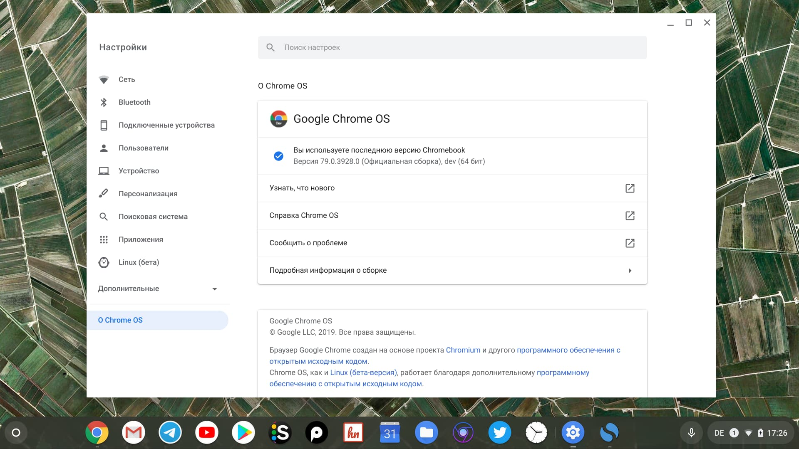

Пользователям Chrome OS доступна функция смены канала обновлений с стабильного на бета или development-канал. Переход на один из этих каналов даёт нам возможность попробовать новые функций операционной системы, которые на данном этапе находятся в тестирований или в разработке и поэтому могут работать некорректно.

Переключившись на нестабильную ветку, на мой хромбук установилась 79 версия Chrome OS, правда все с той же версией Android 7.

То какая версия доступна для вашего хромбука на разных каналах, зависит от самого устройства. Проверить доступные версии можно на [этой страничке](https://cros-updates-serving.appspot.com/).

_Приложние настроек Chrome OS - Подробная информация о системе_

Для того чтобы переключиться с стабильной ветки на другую, необходимо перейти в `"Настройки -> О Chrome OS -> Подробная информация о сборке -> Канал (Выбрать другую версию)"` и после этого нажать на кнопку для проверки обновлений. После установки обновления ваш хромбук перезагрузится и запустится уже с новой версией.

_Dev-канал с версией Chrome OS 79_

PS: Стоить помнить, что если версия ОС с бета-или dev-канала будет работать нестабильно, то в любой момент можно будет перейти обратно.
