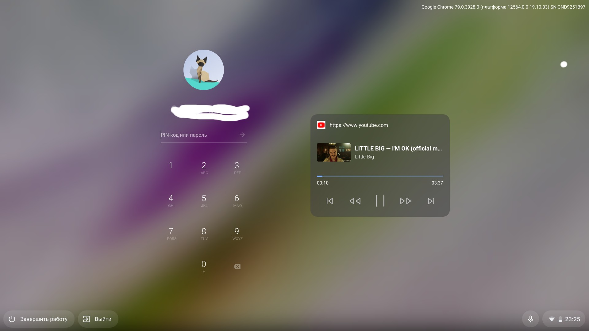

Одной из новых функций доступных на [нестабильной](https://pro-chromeos.ru/perehod-na-dev-kanal/) ветке Chrome OS 79 является виджет для управления мультимедиа контентом с экрана блокировки устройства.

Сценарий использования данной функций очевиден. Аналогично, как и на Android или iOS-устройствах, виджет позволит управлять музыкой напрямую с заблокированного устройства без надобности его разблокировки.

*Пример с мультимедиа виджетом для управления контента с Youtube*

Для активаций виджета необходимо перейти на страницу `chrome://flags` и активировать функцию [Lock screen media controls](chrome://flags/#lock-screen-media-controls).
