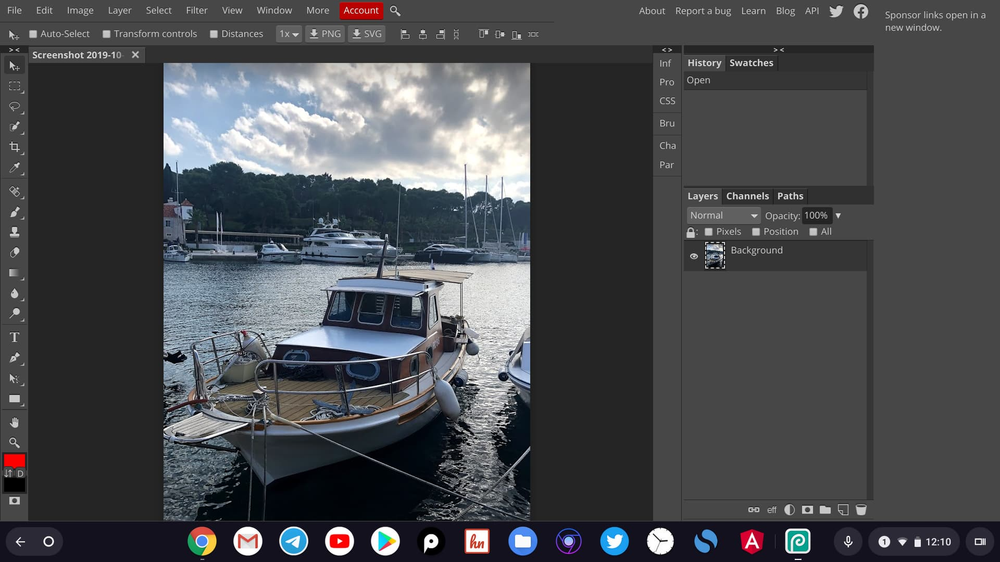

Поддержка Linux-режима позволяет всем желающим установить полноценную версию редактора GIMP на свой хромбук. Но если вам не по душе этот редактор и вы привыкли к интерфейсу, возможностям и горячим клавишам Фотошопа, то для вас есть очень достойная альтернатива в лице редактора [Photopea](https://www.photopea.com/). Photopea представляет из себя веб-приложение с бесплатным фото-редактором доступное для любой платформы из современного браузера. К слову, разработчик так же добавил и платную версию редактора с дополнительными фичами.

_Интерфейс редактора Photopea_

Что касается установки, то редактор имеет поддержку PWA, поэтому для быстрого доступа и удобного использования его можно установить как отдельное приложение и запускать из лаунчера или закрепить на нижней панели приложении Chrome OS.

Что касается внешнего вида и интерфейса, то при первом же взгляде, вы увидите сходство с популярным решением от Adobe. Сверху можно найти привычное меню, как у взрослых приложений, слева располагается панель инструментов, а справа привычные панели с навигацией, слоями и т.д.

Ещё одной особенностью сервиса является поддержка формата PSD, то есть приложение позволит вам открыть и отредактировать файл сохранённый в Photoshop.

PS: В Chrome App Store доступен целый ряд приложений для "простой" обработки фото, например, применить фильтр, повернуть фото, затемнить/высветить и .п. А какими редакторами фото и графики пользуетесь Вы? Было бы интересно собрать разные ссылки и мнения в комментариях :-)
