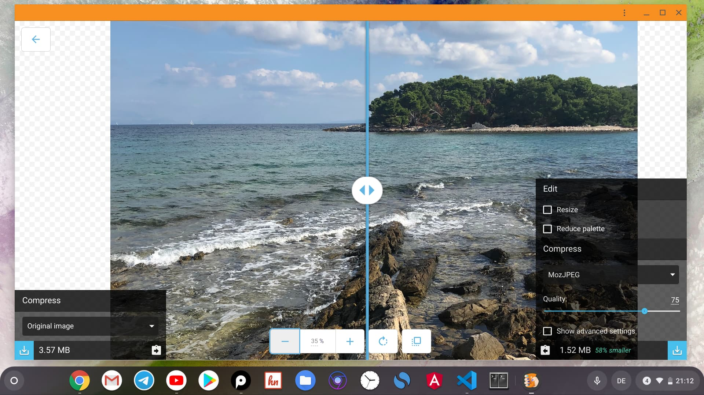

Подготавливая фото и скриншоты для публикации на сайте, регулярно приходится заниматься оптимизацией и сжимать снимки для быстрой загрузки сайта. В целом для этого существует множество различных инструментов и сервисов, но сегодня я бы хотел выделить приложение от Google под названием [Google Squoosh](https://squoosh.app/).

_Оптимизация изображений с помощью приложения Google Squoosh_

Принцип работы Google Squoosh довольно прост. Выбираем необходимое вам изображение и перетягиваем его в интерфейс приложения. Спустя несколько секунд оно будет сжато с использованием одного из выбранных алгоритмов, а в правом нижнем углу интерфейса появится кнопочка для скачивания сжатого изображения. Кроме этого в правой части приложения доступны и другие настройки, которые позволят выбрать алгоритм, изменить размер и качество/процент сжатия выбранного изображения. Там же указан и новый размер оптимизированного файла.

Жаль, что на данный момент нельзя загружать сразу несколько файлов и приходится сжимать их по одному. В остальном приложение является отличным инструментом, которое полностью справляется со своей задачей и радует минималистичным внешним видом.

Squoosh доступна в виде PWA, поэтому можно легко установить приложение и запускать его из лаунчера Chrome OS.
