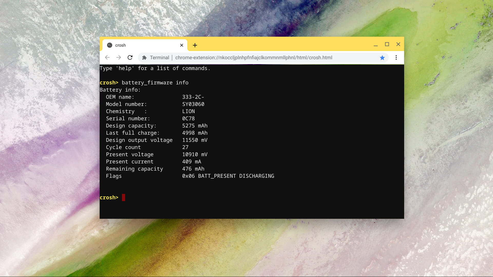

Одной из полезных функций встроенного терминала Chrome OS является команда для проверки состояния батареи. Если вы собираетесь покупать поддержанный хромбук, то возможно это одна из тех вещей на которую стоит обратить внимание.

Для того чтобы запустить тест батареи необходимо открыть терминал `crosh` (Ctrl + Alt + T) и выполнить следующую команду:

`$ battery_test 60`

Число 60 после самой команды обозначает количество секунд для проведения теста. Если ничего не указать, то по умолчанию диагностика займет 300 секунд. После завершения в командной строке появится процентное значение отображающее состояние здоровья батареи вашего устройства. Спустя около двух месяцев использования моего хромбука, тест батареи моего хромбука показал следующий результат:

_Проверка состояния батареи Chromebook'a_

Для того чтобы получить подробную информацию о батарее вашего хромбука, можно выполнить следующую команду:

`$ battery_firmware info`

Помимо информации о объеме батареи, здесь же можно увидеть ёмкость и количество циклов перезарядки устройства.

_Данные о батарее хромбука_
