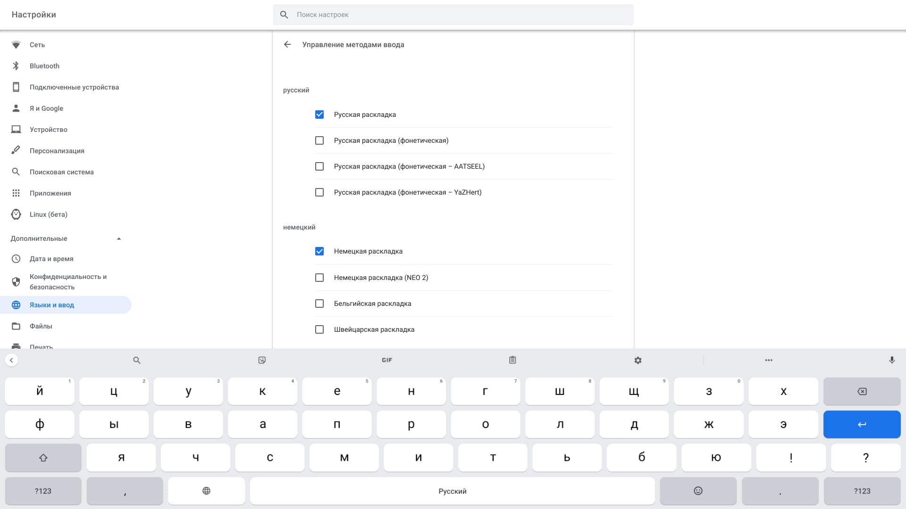

В то время как Google выкатила стабильную версию Chrome OS 79, на мой Chromebook стала доступна 80 версия системы из dev-канала. Вместе с самой операционной системой на моем устройстве так же обновилась версия Android с 7 до 9. И вместе со всеми этими обновлениями появилась, долгожданная мною, возможность смены стандартной клавиатуры Chrome OS на любую другую андроидовскую. Тем самым, Google не то чтобы решила проблемы стандартной виртуальной клавиатуры с русской раскладкой, на которые я жаловался в одном из постов, но дала нам возможность использования альтернатив и это тоже здорово.

_Gboard - Альтернативная клавиатура в Chrome OS_

Я сразу же установил клавиатуру Gboard, которую я с удовольствием использую на своем смартфоне и теперь, например, могу полноценно использовать функцию непрерывного ввода, продвигать курсор пробелом, быстро переключаться между языками, настраивать внешний вид и т.д.

### Как активировать альтернативную клавиатуру

1. Первым делом переходим в Play Store и устанавливаем необходимую вам клавиатуру (Gboard, SwiftKey и т.п.).
2. Открываем настройки системы и переходим на страницу "Языки и ввод". Здесь нажимаем на "Упоравление методами ввода" и в самом низу страницу активируем "Gboard".

_Активация клавиатуры в настройках операционной системы_

Для переключения между клавиатурами можно аналогично, как и в в мобильном приложений, использовать иконку смены языков.

_Переключение между клавиатурами_
