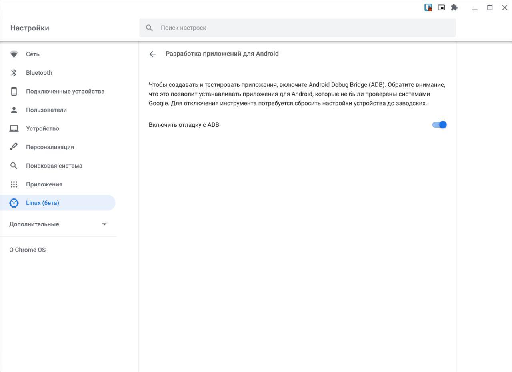
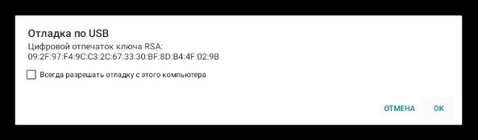
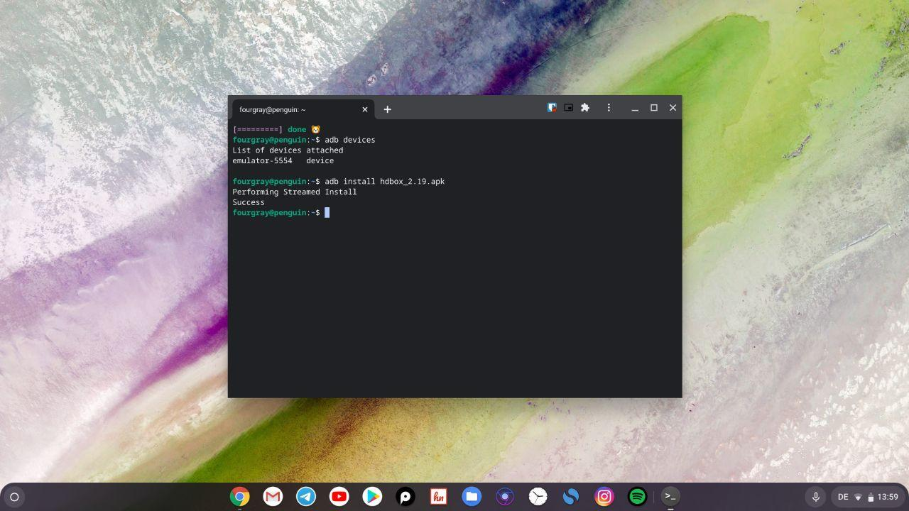
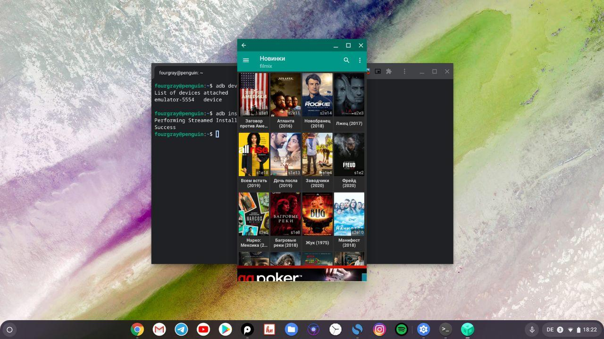
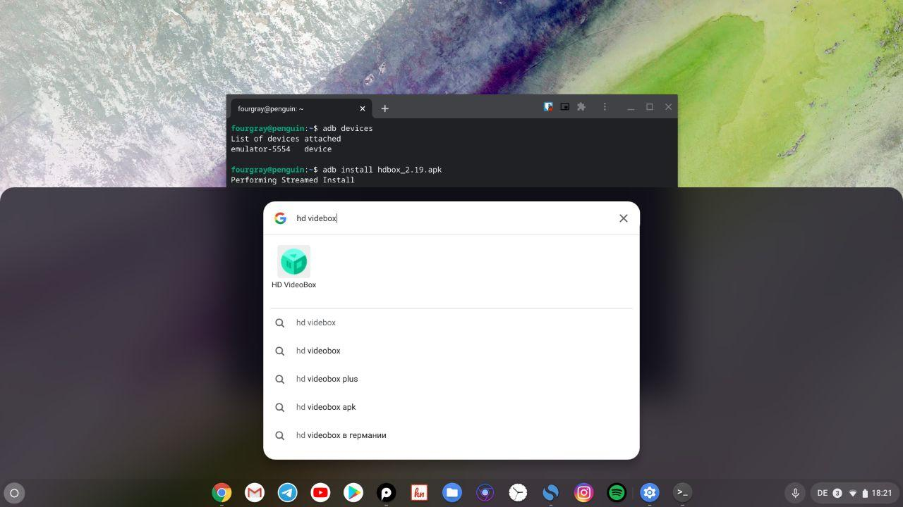

Одним из популярных вопросов связанных с Chrome OS является тема установки apk-приложений скачанных из интернета. В этом посте мы рассмотрим этот вопрос, как установить apk-приложения без активации режима разработчика (Developer Mode). Перейдем к пошаговой инструкции.

1. Если на вашем хромбуке еще не активирован режим Linux, то это необходимо будет сделать в первую очередь. И сразу после этого перейти в настройки Linux, перейти на страницу "Разработка приложений для Android" и активировать пункт "Включить отладку с ADB". После чего ваше устройство перезагрузиться.

  
  _Настройки Chrome OS_

2. После этого нам необходимо установить ADB на наше устройство. Для этого переходим на страничку проекта [nexus-tools](https://github.com/corbindavenport/nexus-tools), копируем команду для установки ADB и выполняем ее в командной строке. Если установка прошла успешно, то после перезапуска приложения терминала, мы сможем воспользоваться инструментом ADB.

3. Перезапускаем приложение терминала и проверяем список устройств с помощью команды `adb devices`. В этот момент на экране откроется новый диалог с запросом о разрешении отладки по USB, нажимаем "OK" и наконец, выполняем команду для установки скачанного вами приложения:

`adb install myapp.apk`

  

  _Запрос на разрешения отладки по USB_

  
  _Установка apk в терминале Chrome OS_

  
  _Приложение HD Videobox в Chrome OS_

В случае если установка прошла успешно, то установленное приложение станет доступным в меню вместе со всеми остальными приложениями.

  
  _App Launcher Chrome OS_

