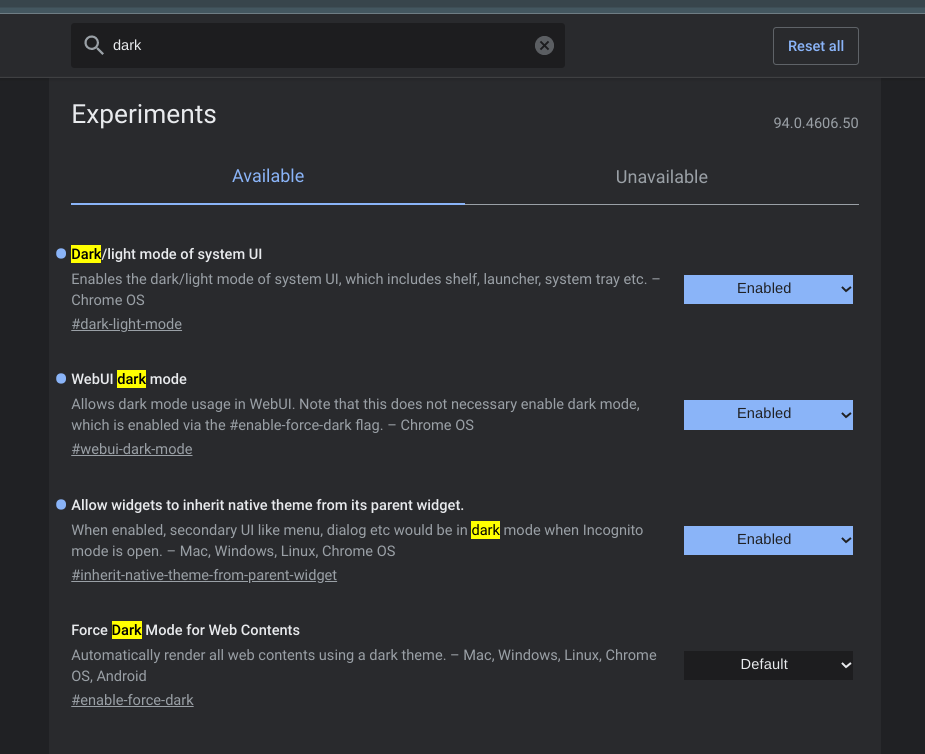
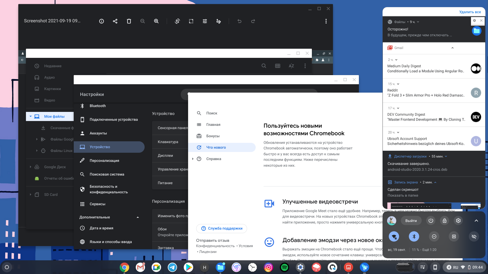
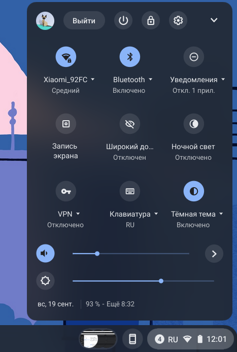
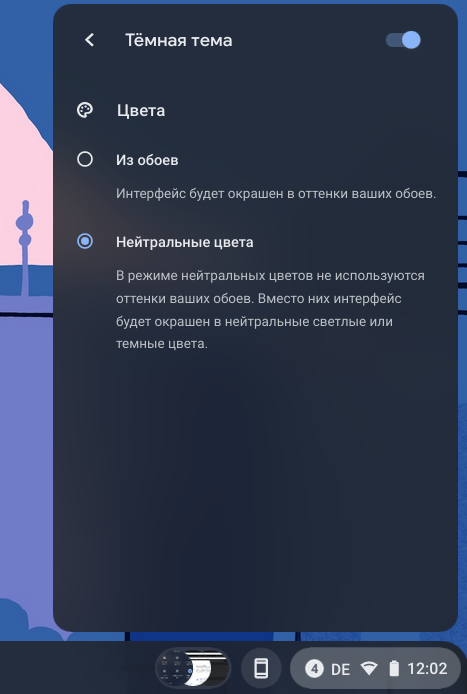

Благодаря сразу нескольким экспериментальным флагам, в рамках Chrome OS появилась возможность активации тёмной темы для всей операционной системы. Сразу предупреждаю, работает это пока что не идеально, что будет продемонстрировано на скриншоте ниже, но тем не менее это шаг вперёд.

  
  _Так выглядят несколько приложении с тёмной темой. Где-то это работает хорошо, где-то частично, где-то совсем нет_

Для того чтобы перейти на "тёмную сторону" необходимо выполнить следующие шаги:

1. Переходим на страницу с флагами в браузере - [chrome://flags](chrome://flags)
2. Ищем по слову "dark". На данный момент на бета ветке Chrome OS 94 доступны следующие опции:

  
  _Флаги для активации темной темы_

3. Активируем первую из них, остальные по желанию. 
4. Для применения настроек, нажимаем на кнопку перезагрузки и активируем тему из центра уведомлений или из приложения настроек.

  
  _Флаги для активации темной темы_ 
  
  _Настройка цветов темы_

В качестве дополнительной опции для настройки цветов доступен выбор между двумя вариантами — "Цвета извлеченные из обоев" или "Нейтральные цвета".