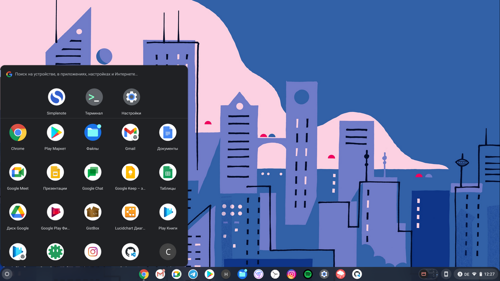

Хорошая новость для тех, кто не является фанатом полноэкранного лаунчера с большим списком приложении. В Chrome OS стал доступен очередной экспериментальный флаг, который заменит стандартный лаунчер на компактное меню в стиле Windows. На данный момент иконки в меню отображаются исключительно в виде плитке, опции для отображения приложений в виде списка пока что нет. В верхней части меню доступен поиск по приложениям, а под ним находится список недавно использованных документов.

  
  _Экспериментальное меню приложений в стиле Windows_

Чтобы попробовать такое меню, переходим на страницу с флагами и активируем опцию под названием "Productivity experiment: App Launcher" (`chrome://flags/#productivity-launcher`)