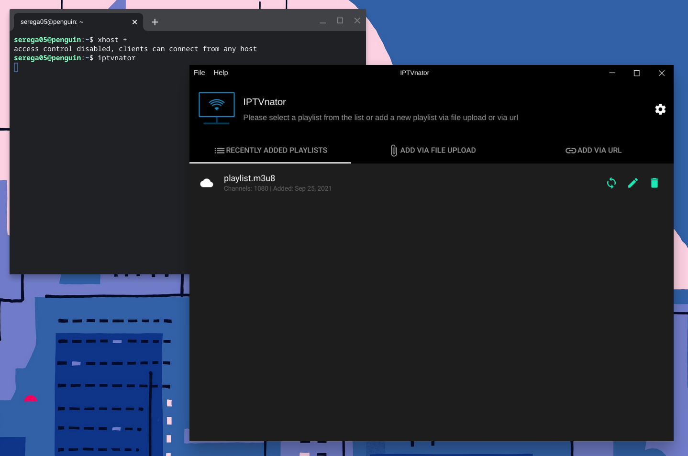

Благодаря возможности запуска Linux в рамках Chrome OS пользователи хромбуков получают поддержку множества приложении разработанных для этой операционной системы. В данном посте будет рассмотрена возможность установки и запуска программ упакованных в пакеты формата snap. 

Главным отличием пакетов snap от других форматов, типа deb, rpm и т.д. это обращение с зависимостями необходимыми для самого приложения. Дело в том, что пакет snap содержит в себе все необходимые зависимости для корректной работы приложения. С одной стороны это влияет на размер пакета и занятое место на жёстком диске, с другой стороны приложение не влияет ни на какие глобальные зависимости и запускается в отдельном изолированном контейнере. 

## Установка snap:

Подтягиваем информацию о свежих пакетах и обновляем их:

```
$ sudo apt update && sudo apt upgrade
```

Устанавливаем сам snap и необходимые зависимости:

```
$ sudo apt install -y libsquashfuse0 squashfuse fuse snapd
```

... перезагружаемся.

## Установка первого приложения:
После установки snap есть два способа для установки самих приложений. Можно воспользоваться Snap CLI, т.е. командной строкой, либо установить Snap Store. 

В качестве тестирования предлагаю установить приложение для просмотра IPTV - IPTVnator. 

Для установки выполняем следующую команду:

```
sudo snap install iptvnator
```

... и запускаем:

```
$ iptvnator
```

В случае если приложение не запустится, то выполняем следующую команду, которая позволяет пользователю получить доступ к  текущему X-серверу отвечаещему за создание графической среды.

```
$ xhost +
```

  
  _Запуск snap пакета на Chrome OS_

## Установка Snap Store:
Snap store представляет из себя отдельный  классический магазин приложений с пакетами snap с отображением рейтинга и возможностью комментирования. Для его установки открываем терминал и выполняем:

```
$ sudo snap install snap-store
```

## Запуск приложения:
Запустить установленное приложение можно через строку терминала, указав его название. 

```
$ xhost +
$ snap-store
```


## Полезные команды для работы с snap CLI

Список всех команд для работы с Snap CLI можно узнать выполнив:

```
snap help
```

## Доступные пакеты

Ознакомиться со списком всех доступных приложений можно [на официальном сайте](https://snapcraft.io/store).


  _Главная страница Snapcraft_


  _Firefox в Chrome OS_

