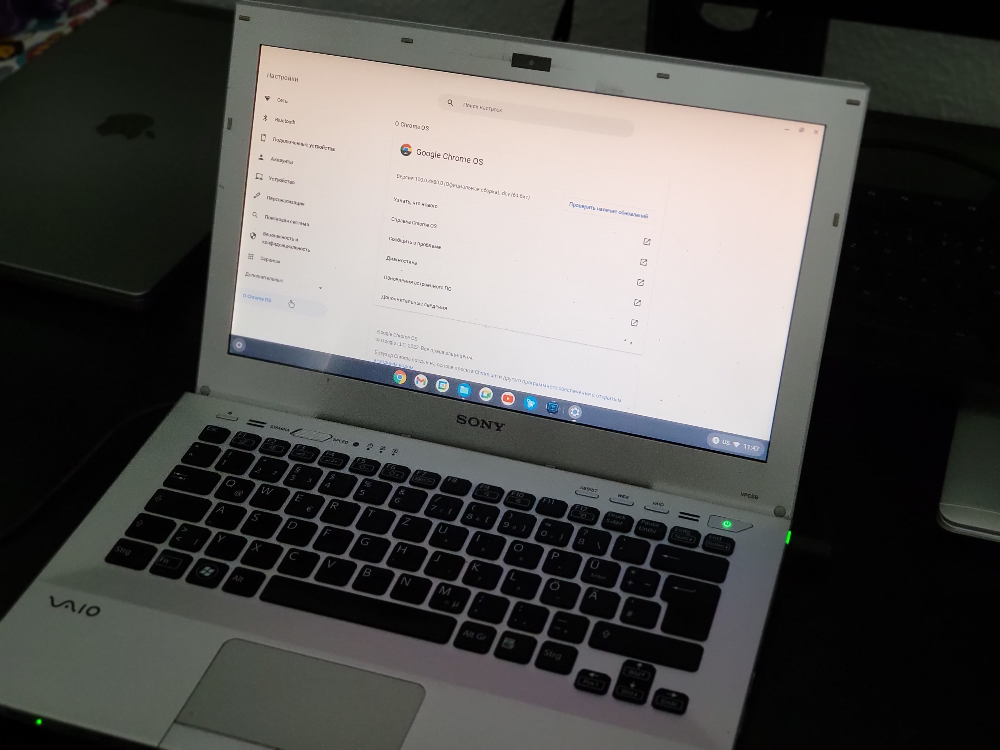
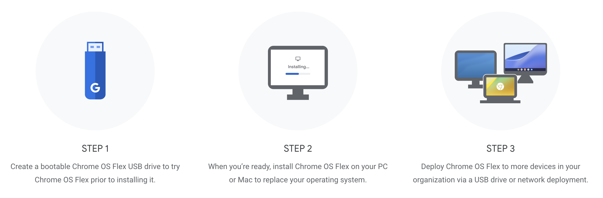
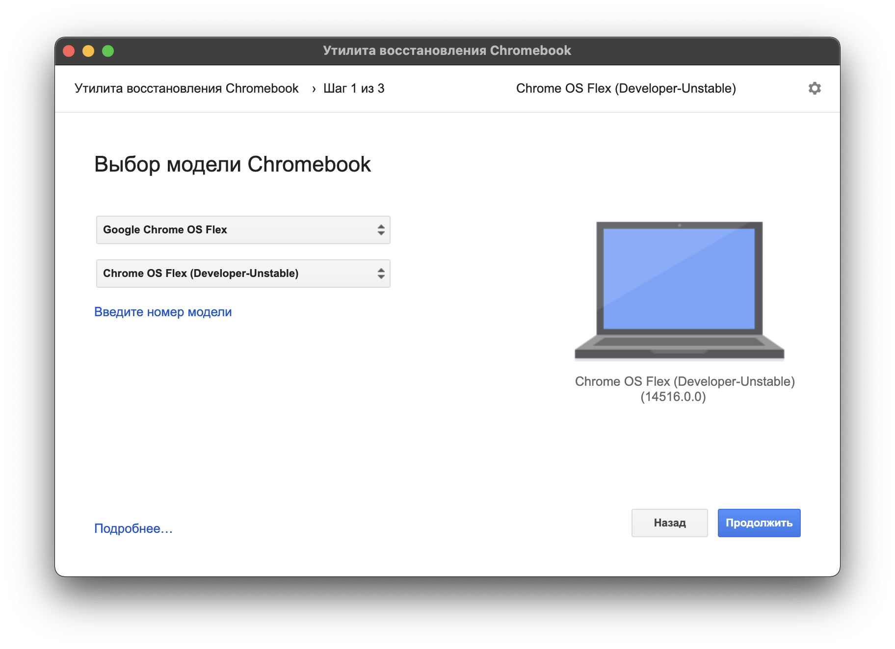

На днях Google опубликовала официальную сборку "новой" ОС под названием [Chrome OS Flex](https://chromeenterprise.google/os/chromeosflex/), которую можно установить на практически любой компьютер. Я считаю это подходящим вариантом для тех, кто не может принять решение о покупке хромбука и перед этим хотел бы попробовать систему в деле.

_Chrome OS Flex v100 на Sony Vaio_

## Что скрывается за Chrome OS Flex?

До этого времени официальной сборки доступной для ["безкостыльной"](https://github.com/sebanc/brunch) установки Chrome OS на ПК не было. Единственным таким решением был продукт под названием [Cloudready](https://www.neverware.com/blogcontent/2022/01/26/cloudready-v962-released) от компании Neverware, которая уже с 2020 года принадлежит Google.
C релизом Chrome OS Flex сборка Сloudready прекратит свое существования и все системы [получат обновления](https://support.google.com/chromeosflex/answer/11547280?hl=en&ref_topic=11618314) до Chrome OS Flex.

## В чем разница между Chrome OS Flex и Chrome OS?

Визуально "новая" операционная система мало чем отличается от главной Chrome OS. Обе системы основаны на Open Source'ной Chromium OS. Но под капотом все-таки Chrome OS Flex имеет некоторые ограничения. Например, система не поддерживает Google Play Store, а еще на моем стареньком Sony Vaio 2010 года не получилось активировать Linux окружение.
Полное описание всех различий собрано на [этой странице](https://support.google.com/chromeosflex/answer/11542901).

Если вы все ещё заинтересованы в тесте системы, то далее будет описан процесс создания USB-флешки с которой можно загрузиться в систему, либо полноценно установить её на своё устройство.

## Устанавливаем систему

_Установка Chrome OS Flex_

Первым делом находим USB-флешку на минимум 8гб и устанавливаем дополнение [Chromebook Recovery Utility](https://chrome.google.com/webstore/detail/chromebook-recovery-utili/jndclpdbaamdhonoechobihbbiimdgai/related) в браузер, которое позволит нам создать загрузочное устройство.

Открываем дополнение и в качестве модели Chromebook выбираем систему Google Chrome OS Flex и то же самое во втором поле ниже.

_Выбор операционной системы Google Chrome OS Flex в Recovery Utility_

Нажимаем "Продолжить", указываем флешку и ждем завершения процесса. После этого можно перезагружаем компьютер и сразу попадаем систему Chrome OS. Единственное что необходимо сделать так это убедиться в том, что в BIOS'е вашего устройства USB-накопитель был выбран в качестве приоритетного девайса для загрузки.

Если это так, то вас поприветствует светлый экран с логотипом Chrome и откроется экран настройки системы. Здесь необходимо будет настроить сеть WiFi и войти в свои Google аккаунт. После первоначальной настройки, можно просто поиграться с системой, либо полноценно установить ее на ваше устройство. Сделать это можно нажав по центру оповещений и выбрав опцию "Install Chrome OS". При этом стоит помнить, что установщик системы довольно таки примитивный и сразу предупреждает что удалит все остальное с жесткого диска и установит только Chrome OS.

На этом всё, если что-то не получилось то более детальную инструкцию по установке можно найти на [официальной странице](https://support.google.com/chromeosflex/answer/11552529?hl=en&ref_topic=11551271&visit_id=637807323875811379-1441237508&rd=1) о Chrome OS Flex.
